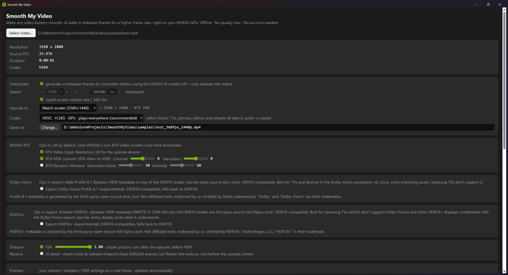

  

<h1 align="center">Smooth My Video</h1>

  <b>Offline AI frame interpolation for NVIDIA GPUs.</b> 
  Drop in a video, pick a target frame rate, and get a buttery-smooth high-FPS copy,
  no cloud, no subscription, no install.

   
  <b>The same shot, before and after.</b> Left: a classic anime-style pan at 10 fps, the cadence anime pans are actually drawn at. Right: the same clip interpolated 5&times; to 50 fps. Every original frame passes through untouched; the AI draws only the frames in between.

   
  <b>It also brings 108-year-old anime back to life.</b> Left: <i>Namakura Gatana</i> (1917, public domain), 15 fps with a century of film grain. Right: the same frames after AI detail restoration, 2&times; RTX upscale and 15&rarr;50 fps interpolation, one render. 
  <i>Source: the National Film Center scan, via the Internet Archive (Public Domain Mark).</i>

> *Built because NVIDIA's RTX Video (AI upscaling + TrueHDR) is gorgeous but playback-only: it enhances
> what you watch, then throws it away. Smooth My Video applies those same RTX passes (plus AI frame
> interpolation) straight to your file, so the result is saved, not just streamed.*

---

## What it does

Pick a video (or drag it in), choose a **target frame rate** (double it, 4×, 8× and up, or **match
your monitor's refresh**), and click **Smooth It!**. Smooth My Video generates the in-between frames
with a GMFSS AI model on your GPU and writes a smoother, high-frame-rate copy right next to the
original. In the same render it can also **upscale** (up to 16K), **sharpen**, **restore detail**, and
convert **SDR → real HDR10**, while carrying over every audio track, subtitle, chapter and font.

  

Built and tested on an RTX 5090 Laptop; runs on any recent NVIDIA GPU with a current driver.

## Why choose it

- 🎞️ **Smooth *and* sharp.** Your real frames pass through at full quality with AI-generated frames woven
  in between, you get the higher frame rate without softening or reprocessing the original footage.
- 🧊 **10-bit output by default.** Float-precision interpolated frames are written at 10-bit, so smooth
  gradients (skies, glows) never band into visible steps.
- 🎨 **Production-grade HDR10.** Real SDR→HDR10 conversion with proper mastering metadata
  (mastering-display + measured MaxCLL/MaxFALL) and faithful, cyan-free colour, not just a PQ tag.
- 🌈 **Dolby Vision Profile 8.1 export (experimental).** Optionally add Profile 8.1 dynamic-HDR metadata on
  top of the HDR10 render, HDR10-compatible, so non-DV players fall back to HDR10. Uses the
  separately-installed open-source [dovi_tool](https://github.com/quietvoid/dovi_tool); no Dolby software
  is bundled.
- ➕ **HDR10+ export (experimental).** Optionally embed HDR10+ (SMPTE ST 2094-40) dynamic-HDR metadata,
  measured per frame from the actual render, also HDR10-compatible, and combinable with Dolby Vision.
  Uses the separately-installed open-source
  [hdr10plus_tool](https://github.com/quietvoid/hdr10plus_tool).
- 🔍 **AI upscaling to 16K + detail restoration.** NVIDIA RTX Video Super Resolution plus a Real-ESRGAN
  restore pass, layered with the interpolation in a single render.
- 💬 **Keeps every track.** All audio, subtitles/translations, chapters and font attachments are preserved
  (auto-switches to `.mkv` when needed), nothing silently dropped.
- 🗜️ **Visually lossless, small files.** HEVC / AV1 / H.266 encodes tuned against a lossless 8K master
  (VMAF ~99.8, SSIM ≥ 0.995), no fiddly quality knob to guess at.
- 📦 **100% offline & self-contained.** Extract the zip and run, no Python, no pip, no ffmpeg to install,
  no account, no cloud upload. Only the NVIDIA driver is assumed. Free.
- ⚡ **Fast.** fp16 with a TensorRT backend, built and cached per resolution; 4K sources interpolate at
  nearly 1080p cost (motion is estimated at a resolution-appropriate scale, automatically). The app also
  tells you when a laptop "Silent" power profile is throttling the GPU.
- 🧺 **Set-and-forget batches.** Queue many files; a file that fails is noted and the rest keep rendering,
  and a batch interrupted by a crash or restart is re-queued on the next launch.
- 📱 **Handles real-world files.** Variable-frame-rate sources (phone clips, screen recordings) are
  detected and timed correctly, so audio never drifts out of sync.
- 🔁 **Reproducible.** The same file with the same settings renders byte-for-byte identically, every time.
- 🎚️ **Plus the essentials:** FSR-style sharpening, a live before/after preview, every setting remembered
  between runs, and a quiet one-line notice when a newer release is out (nothing auto-downloads).

## Get started

- **Download & run:** grab the latest `SmoothMyVideo-<version>-win.zip`, extract it anywhere, and run
  **`SmoothMyVideo.exe`** (or the Desktop / Start-menu shortcut). No install, no dependencies, just a
  current NVIDIA driver. A sample clip ships in `samples/test.mp4`.
- **From source:** `npm start`. See **[DEVELOPMENT.md](DEVELOPMENT.md)** for the full setup.

## Under the hood

The UI is Electron + TypeScript; the interpolation runs in a Python **GMFSS_Fortuna** engine spawned as a
subprocess. GMFSS_Fortuna is a "union" interpolator, GMFlow optical flow, an IFNet/RIFE refiner, plus
MetricNet, FeatureNet, FusionNet and softsplat warping, producing clean frames even at high multipliers.
It runs fp16 with a cupy softsplat kernel and an optional TensorRT backend.

📖 **Build it, hack on it, or read the design rationale → [DEVELOPMENT.md](DEVELOPMENT.md)**

## Contributing

Smooth My Video was built end to end by AI coding agents ([Claude Code](https://claude.com/claude-code)),
and it's meant to keep growing that way. If there's a feature you want, open an issue and describe it, or
send a pull request. Contributions are welcome whether you write the code yourself or hand the idea to an
agent, exactly how the rest of this app was built.

---

Dolby and Dolby Vision are trademarks of Dolby Laboratories. Smooth My Video is an independent project and
is not affiliated with, endorsed by, sponsored by, or certified by Dolby Laboratories. Dolby Vision Profile
8.1 metadata is produced by the separately-installed, third-party open-source
[dovi_tool](https://github.com/quietvoid/dovi_tool); no Dolby software is bundled or redistributed.
HDR10+ is a trademark of HDR10+ Technologies, LLC; Smooth My Video is likewise not affiliated with, endorsed
by, or certified by HDR10+ Technologies. HDR10+ metadata is injected by the separately-installed, third-party
open-source [hdr10plus_tool](https://github.com/quietvoid/hdr10plus_tool); no HDR10+ LLC software is bundled
or redistributed.
