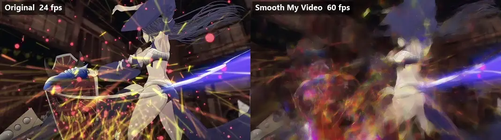
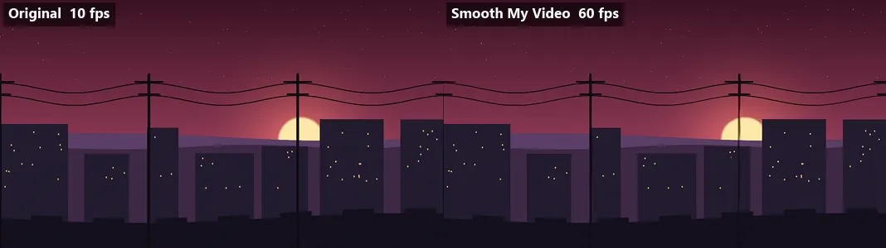

  

<h1 align="center">Smooth My Video</h1>

  <b>Offline AI frame interpolation for NVIDIA GPUs.</b> 
  Drop in a video, pick a target frame rate, and get a buttery-smooth high-FPS copy. 
  No cloud, no subscription, no install.

  
  
  

  <a href="#get-started">Get started</a> ·
  <a href="#models">Models</a> ·
  <a href="#picture">Picture</a> ·
  <a href="#file-renders">File renders</a> ·
  <a href="#live-mode">Live mode</a> ·
  <a href="#command-line">Command line</a>

   
  <b>The same scene, before and after.</b> About 8 seconds from episode 1 of <a href="https://sh-anime.shochiku.co.jp/jukishi-anime/"><i>The Exiled Heavy Knight Knows How to Game the System</i></a>, downscaled. Left: the source frames at 24 fps, no interpolation. Right: Smooth My Video's 60 fps render with the default GMFSS model, drawing the frames in between through sparks, blades, camera moves and a backflip. 
  <i>&copy; Nekoko, BroccoLee, Jaian, KODANSHA/"The Exiled Heavy Knight Knows How to Game the System" Production Committee (&copy;猫子・武六甲理衣・じゃいあん・講談社／「追放された転生重騎士はゲーム知識で無双する」製作委員会)</i>

   
  <b>Slow pans, too.</b> Left: an anime-style pan at 10 fps (drawn procedurally for this README), the cadence anime pans are actually drawn at. Right: interpolated 6&times; to 60 fps. Every original frame passes through untouched; the AI draws only the frames in between.

> *NVIDIA's RTX Video (AI upscaling + TrueHDR) is gorgeous but playback-only: it enhances what you watch, then
> throws it away. Smooth My Video applies those same RTX passes, plus AI frame interpolation, straight to your
> file, so the result is saved, not just streamed.*

---

## Two modes

A **Video / Live** switch at the top of the window picks the mode. Each mode shows only its own controls, plus the
settings both share. The panels are numbered in the order the passes run.

<table>
  <tr>
    <td align="center" width="50%"><b>Video</b>: render a smoother copy of a file</td>
    <td align="center" width="50%"><b>Live</b>: smooth any window in real time</td>
  </tr>
  <tr>
    <td></td>
    <td></td>
  </tr>
  <tr>
    <td valign="top">Pick a video (or several, or drag them in), set a <b>target frame rate</b> and click
    <b>Smooth It!</b>. The smooth copy is written next to the original, with its audio tracks, subtitles and
    chapters carried over.</td>
    <td valign="top">Smooths any window on your screen (a video player, a browser, a windowed game) or the whole
    screen, with no file to render, Lossless-Scaling-style.</td>
  </tr>
</table>

**Speed** is shared by both modes: type a target fps, or pick **Screen refresh rate** to match the monitor the app's
window is on (read when the app starts). A file render keeps the exact rate (decimals allowed, so 59.94 stays 59.94),
must be above the source rate and goes up to 100&times; it; the hint shows the ratio to the source, a whole multiple
is "on-grid", and the **&asymp;** button snaps a target to the nearest one. Live rounds the target to a whole fps,
up to 10000.

## Get started

1. Download `SmoothMyVideo-<version>-win.7z` from the
   [latest release](https://github.com/flowreen/SmoothMyVideo/releases/latest) (its `.sha256` and the release notes
   sit beside it).
2. Extract it anywhere. Windows 11 23H2 and later open `.7z` in File Explorer; on older Windows use
   [7-Zip](https://www.7-zip.org/).
3. Run **`SmoothMyVideo.exe`**. A second launch just brings the running window forward.

**Requirements:** an NVIDIA RTX GPU with a current driver. No Python, pip or ffmpeg to install, no account, no cloud
upload, and it is free. Built and tested on an RTX 5090 Laptop.

**Optional one-time setups.** Everything else ships in the archive. These pieces are not bundled (NVIDIA's DLLs
cannot be redistributed; the two HDR tools are left for you to fetch), so the app shows a short setup box when you
tick the feature. Dropping the file onto the window works too, except for Smooth Motion.

| Feature | What to get | How |
|---|---|---|
| RTX Video Super Resolution, RTX HDR | NVIDIA's RTX Video SDK | **Get from NVIDIA**, then **Choose .zip&hellip;** (or drop the zip). Without it, upscaling uses a Lanczos resize and RTX HDR is unavailable. |
| NVIDIA DLSS 5 | The Neural Rendering runtime (`nvngx_dlssnr.dll`) | One-click **Download the DLSS 5 runtime** ([details](#nvidia-dlss-5)), or drop the file. |
| NVIDIA Smooth Motion | `NvOFFRUC.dll` from NVIDIA's Optical Flow SDK | **Get from NVIDIA**, then **Choose .zip&hellip;**. GMFSS is used until it is installed. |
| Dolby Vision, HDR10+ | The open-source [dovi_tool](https://github.com/quietvoid/dovi_tool) / [hdr10plus_tool](https://github.com/quietvoid/hdr10plus_tool) | **Get &hellip;**, then **Choose .zip&hellip;** (or drop the file). |

**From source:** `npm start`. See **[DEVELOPMENT.md](DEVELOPMENT.md)** for the full setup.

## Models

One interpolation model at a time; every model works in file renders and in Live. **GMFSS** is the default. Untick
every model to apply only the picture passes, at the source frame rate. Hover a row to see its exact version.

| Model | Best for | Needs | Notes |
|---|---|---|---|
| **GMFSS** (default) | Anime | Any RTX GPU | GMFSS_Fortuna, a "union" interpolator; clean frames even at high multipliers. TensorRT-accelerated. |
| **RIFE** (Practical-RIFE 4.26 heavy) | Live action, filmed content | Any RTX GPU | The strongest open general-purpose interpolation model. TensorRT-accelerated. Its **DRBA** (anime pacing) option keeps characters at their original animation cadence while camera pans smooth fully; in Live it adds one source frame of delay (it needs the next frame first). |
| **NVIDIA DLSS 4.5** (DLSS Frame Generation) | NVIDIA's game frame generation, on video | RTX 40/50, a recent driver, Windows hardware-accelerated GPU scheduling; above 2&times; needs an RTX 50 | Whole multipliers 2&times;&ndash;6&times;. Bundled (~10 MB NVIDIA-redistributable Streamline runtime), hosted offline by a bare-bones D3D12 presentation loop, since DLSS-FG has no video API. [One caveat](#dlss-45-and-rtx-video-in-a-browser). |
| **AMD FSR 4** frame generation | An alternative ML look | Any RTX GPU (tested on an RTX 5090) | AMD's machine-learning model, steered by NVIDIA's optical flow, running through the open-source vkd3d-proton (D3D12 on Vulkan). Cleaner than FSR 3.1 on fast pans, though fine edges can still break up on fast anime motion where GMFSS stays clean. Its shaders compile once per driver, in the background, as soon as you pick it. Varies slightly from run to run. |
| **NVIDIA Optical Flow** | Fast renders, moderate motion | Nothing extra: the driver provides it | NVIDIA's hardware optical-flow unit. Clean on moderate motion; where very fast or twisting motion defeats the hardware's vectors, it fades to a soft double image instead of breaking up. File renders take a whole multiplier (it tells you when the Speed target is not one). |
| **NVIDIA Smooth Motion** | The NVIDIA look, or a non-AI reference | A one-time runtime ([setup](#get-started)) | Hardware optical-flow FRUC, the same family as the driver-level Smooth Motion. The lowest quality of the models; varies from run to run. |

## Picture

These passes run in the same render, before the interpolation (in Live, on the captured frames; see
[Live mode](#live-mode) for how each applies there):

* 🔍 **Restore**: Real-ESRGAN detail restoration (it cleans compression noise, but can flatten fine texture). Off at
  every launch.
* 📐 **Upscale**: NVIDIA RTX Video Super Resolution (on by default) or AMD FSR 4.1, AMD's AI upscaler; tick one or
  the other, neither = a classic Lanczos resize. The AI upscaler runs only when the picture is enlarged.
* 🧠 **NVIDIA DLSS 5** (optional): Neural Rendering on every source frame. [Details](#nvidia-dlss-5).
* ✏️ **Sharpen**: bacondither's Adaptive Sharpen (two-pass HQ), strength 0 to 2 (on at 1.00 by default).
* 🎨 **RTX HDR**: NVIDIA's TrueHDR turns SDR into real HDR10, with **Contrast** and **Saturation** sliders and an
  optional **RTX Dynamic Vibrance** (Saturation boost, and Intensity for muted colours only, skin kept). HDR sources
  are carried through as they are.

In the preview, **Show changed pixels** turns the Processed pane into a heat map of where DLSS 5 changed the picture.

## File renders

* 🎯 **On-grid keeps the real frames.** At a whole multiple of the source rate, every real frame is kept and the AI
  draws only the frames in between (the real frames still get the picture passes you tick). Other targets resample
  every output frame. Two exactly identical frames in a row (a paused picture, a held drawing) pass through as they
  are, so a still image stays perfectly still.
* 📏 **One Size control.** Pick the output **Size**: Off, your screen's resolution, 720p, 1080p, 1440p, 2160p, 4320p,
  8640p, or a custom height (down to 240p for small, fast-to-encode files, up to 16K). Restore and the resize run
  first, then DLSS 5 and the interpolation at that size, up to 3840x2160; a larger output runs them at that cap and
  enlarges the result at the end.
* 🌈 **HDR10 with real metadata**: mastering-display + measured MaxCLL/MaxFALL and faithful, cyan-free colour, not
  just a PQ tag. Optional **Dolby Vision Profile 8.1** (HDR10-compatible, so non-DV players fall back to HDR10) and
  **HDR10+** (SMPTE ST 2094-40, measured per frame from the actual render), combinable. Both need RTX HDR, the HEVC
  codec and an MP4 output; they are skipped, with the reason, when the output must be MKV.
* 🗜️ **Visually lossless, 10-bit.** HEVC (default) or AV1 on the GPU at maximum encoder effort (AV1 falls back to the
  CPU where the GPU has no AV1 encoder), or H.266 (VVC) on the CPU. Tuned and verified against a lossless 8K master,
  with no quality knob to guess at. Output is always 10-bit, so gradients (skies, glows) never band.
* 💬 **Keeps your tracks.** All audio, subtitles / translations and chapters are copied, and the output switches to
  `.mkv` when MP4 cannot carry a track. Font attachments are kept in `.mkv` outputs.
* 📱 **Handles real-world files.** Variable-frame-rate sources (phone clips, screen recordings) stay in sync, HDR10
  and HLG sources stay HDR, and non-square-pixel sources (DVDs, 1440x1080) keep their shape.
* 🔁 **Reproducible.** The same file with the same settings renders byte-for-byte identically, every time, except
  with the NVIDIA Smooth Motion and AMD FSR 4 models.
* ⏯️ **Pause, preview, resume.** **Pause** holds the render; **Play preview** opens the part done so far, with sound
  and subtitles. A render that was closed or crashed continues where it stopped (with the same settings and an
  unchanged source). **Cancel** deletes the partial file. A render never leaves a cut-off file behind.
* 🧺 **Set-and-forget batches.** Pick or drop several files: they render one after another with the same settings, a
  file that fails is noted and the rest keep going, and a batch interrupted by a crash or restart is queued again on
  the next launch.
* 📊 **Always in view.** Frames, render fps, an ETA with the finish time and the projected file size (with a warning
  when the drive is too small), a thumbnail of the frame being written, taskbar progress, and a notification when a
  render or batch finishes while the window is in the background. Your PC will not sleep mid-render.

<b>More: preview, output names, very large outputs, the engine cache</b>

* **Before / after preview:** a still frame with your Restore, resize, DLSS 5, Sharpen and HDR settings, next to the
  original. It updates as you change settings; step to a random frame, and click either image for a synced 1:1 pixel
  view.
* **Output name:** `<name>_<fps>fps` (the fps rounded, so 59.94 gives `_60fps`; plus `_<height>p` when resized) next
  to the source, `.mp4` or `.mkv` as needed. With no model ticked it is `_<height>p`, or `_restored` / `_dlss5` /
  `_sharpened` / `_hdr` after the pass that runs. Edit the **Saves to** path in place or with **Change&hellip;**;
  clearing it brings the automatic name back. After a render, **Open folder** or **Play video**.
* **Outputs above 8192 px** encode on the CPU (AV1 or VVC). The app checks the free memory first (a true 16K render
  needs about 54 GB) and renders RTX HDR only up to 8192 px.
* **Colour:** planar YUV in the BT.709 / 601 / 2020 matrices converts to RGB and back with exact math (zimg), other
  formats with accurate rounding; an untagged source is treated as BT.709 from HD up and BT.601 below, and colour tags
  are carried through. Odd and tiny frame sizes are handled.
* **The engine cache:** TensorRT engines are built once per resolution and kept in `model_cache_safe_to_delete` in
  the app's folder (safe to delete). After an update that changes the engines, the cache empties once and the
  engines rebuild on first use.
* **Speed and power:** fp16 with a TensorRT backend. The app tells you when a laptop "Silent" power profile is
  throttling the GPU.
* **The engine log** is `%TEMP%\smv-engine.log`; an error line in the app points at it.

## Live mode

Real-time frame generation on any window: the Lossless-Scaling-style feature, built in and free.

* **Start:** press the **hotkey** (` by default, changeable with the **Hotkey** button) in any app, or click
  **Smooth It Live!** and then click the window you want within 5 seconds.
* **Stop:** press the hotkey again, or click **Stop**. The hotkey is reserved system-wide while the app runs.
* **Display:** **Whole screen** (the default) smooths the whole monitor the active window is on, everything on it, and
  works with every model including DLSS 4.5. **Original size** smooths only the window. **Fill screen** fills its
  monitor with the window (aspect kept), upscaled with RTX VSR or AMD FSR 4.1 when ticked.
* **Adaptive:** with GMFSS, RIFE or NVIDIA Optical Flow, the output locks to your fps target and the multiplier
  follows the content, so a game dropping from 30 to 10 fps keeps playing at the same smooth rate. NVIDIA Smooth
  Motion and AMD FSR 4 run the largest 2&times; / 4&times; / 8&times; / 16&times; step under the target (60 fps on a
  24 fps source shows 48), and DLSS 4.5 whole multiples, 2&times;&ndash;6&times;.
* **Fit to the GPU** (on by default) lowers the smoothing to what your GPU keeps up with, down to the source's own
  rate with every effect still on, so every source frame is shown with little delay. Unticked, everything runs as set
  and a target the GPU can't reach skips source frames.
* **Readout:** a small green corner readout shows the source fps, the smoothed fps, and roughly how far the picture
  runs behind reality: about a source frame, made for watching, not for competitive play. **Show FPS meter** turns it
  off; **Show latency** hides its latency part.
* **The first session at a new window size** builds its engines first (about 30 s for GMFSS, 45 s for RIFE, 55 s with
  DRBA); later sessions at that size start in seconds.
* **Windowed or borderless windows only** (exclusive fullscreen can't be captured).

<b>More: DLSS mode, effects, HDR displays, what pauses and restarts it</b>

* **DLSS mode** is Live's speed lever: DLSS 5 and the smoothing run at this share of the window or screen (up to
  3840x2160), then the result is enlarged. DLAA (the default, the full size), Quality (67%), Balanced (58%), Performance (50%) or Ultra Performance
  (33%) from the dropdown, or any share down to 1% with its slider (the dropdown then reads Custom). Lower is much
  faster and softer.
* **GMFSS flow scale** (25% to 100%, default 100%) estimates the motion at a smaller size: faster, though small
  fast-moving objects can blur more. It never goes below 320x192.
* **Effects:** Restore, DLSS 5 and Sharpen run on each captured frame before the smoothing, once per captured frame;
  RTX HDR applies on an HDR display. The upscaler (RTX VSR or AMD FSR 4.1) takes whichever resize enlarges: with a
  DLSS mode below DLAA, that is the enlarge after the smoothing. With DLSS 4.5 as the live model the effects run too,
  before its frame generation. Untick every model and Live applies just the effects, at the window's own frame rate.
* **On an HDR display** every model runs in HDR. RTX HDR is meant for SDR windows.
* **Pauses by itself** when the window is minimized, on another virtual desktop, or covered by the window in front,
  and resumes when it is back.
* **Restarts by itself**, on the same window, when you change the Speed target, the DLSS mode, Fit to the GPU or the
  GMFSS flow scale, when the window is resized or moved to another monitor, and if the engine stalls. A closed window
  stops Live.
* **Fill screen and the mouse:** clicks on the stretched picture reach the matching spot of your window. While the
  cursor is on the picture, SMV draws it and slows the pointer by the stretch, and gives the normal pointer back when
  the cursor leaves the picture or Live stops (or if the session crashes).
* **Fast restarts:** every model runs inside the overlay itself, with no separate engine process, which keeps latency
  and processor use low. The loaded model stays ready after Stop, so the next session starts faster (not after a
  session with DLSS 4.5, DLSS 5 or RTX HDR; it is freed after 10 idle minutes or when you pick another model).
* **RivaTuner (RTSS):** if it hooks the overlay, the engine log (`%TEMP%\smv-engine.log`) names it, with the fix.

## NVIDIA DLSS 5

One checkbox runs NVIDIA's DLSS 5 Neural Rendering on every source frame before the smoothing, in file renders and
in Live.

<b>Where it runs, its controls, and the runtime download</b>

* **Where:** after Restore and the resize, at the output size up to 3840x2160 (in Live, at its DLSS mode's size), at
  full resolution: its own size in, the same size out.
* **How it is fed:** the way game integrations feed it, with NVIDIA's automatic mask and motion vectors from NVIDIA's
  Optical Flow hardware. Its history follows the picture, and a paused or held picture stays perfectly still.
* **Controls:** NVIDIA's three looks as a **Style** selector (Default, Natural, Cinematic; Natural is preselected),
  **Structure Intensity** and **Tone Intensity** sliders, and **Passes** (1 to 10): DLSS 5 again on its own result,
  for a stronger effect at that many times the time and video memory.
* **The runtime:** the host is bundled, but the Neural Rendering runtime (`nvngx_dlssnr.dll`) is not, and NVIDIA
  publishes no download for it (it only ships inside NBA 2K27). The one-click **Download the DLSS 5 runtime** button
  fetches the community RTX 40 + 50 build every DLSS 5 tool uses
  ([rhi-repo](https://github.com/RankFTW/rhi-repo/releases) on GitHub), verifies its SHA256 and installs it. Already
  have the file? Drop it on the window instead.
* **In Live:** once per captured frame, inside the overlay host itself. It applies to SDR windows, or the SDR range of
  any window on an HDR display.

## DLSS 4.5 and RTX Video in a browser

NVIDIA's RTX Video enhancement (Super Resolution / Video HDR) processing a video playing in a browser preempts DLSS
frame generation. A file render detects the stall within seconds and heals itself once that video is closed or
paused; if the interference persists, it stops cleanly with progress saved, and **Resume** continues from there.
Other models are unaffected.

## Everyday comforts

* Most settings are remembered between runs (Restore and RTX Dynamic Vibrance start off each launch), and so is the
  window size.
* Zoom the interface with Ctrl+= / Ctrl+- / Ctrl+0, or Ctrl + mouse wheel.
* The source panel shows the resolution, the frame rate (the exact fraction on hover), the duration and the codec,
  plus the track counts when there is more than one audio track or any subtitle.
* A quiet one-line notice appears when a newer release is out (nothing auto-downloads).

## Command line

File renders also run without the window: `node dist\render\cli.js <input> <multiplier> [output] [flags]` takes the
same settings the GUI builds (plus a few extras, such as the Frame Blend model and a working-size setting for file
renders), and the native host can start Live on a window by its title. See
**[DEVELOPMENT.md](DEVELOPMENT.md)** for every flag.

## Under the hood

The UI is Electron + TypeScript. Every render and Live session runs in one native host (`smv-live.exe`, C++ on
TensorRT for RTX and CUDA), driven by a TypeScript orchestrator that handles probing, encoding (ffmpeg) and resume;
DLSS 4.5 file renders run NVIDIA's frame generation in a small separate helper. No Python ships. The default model, **GMFSS_Fortuna**, is a "union" interpolator: GMFlow optical flow, an IFNet/RIFE refiner,
plus MetricNet, FeatureNet, FusionNet and softsplat warping.

📖 **Build it, hack on it, or read the design rationale: [DEVELOPMENT.md](DEVELOPMENT.md)**

## Contributing

Smooth My Video was built end to end by AI coding agents ([Claude Code](https://claude.com/claude-code)), and it's
meant to keep growing that way. If there's a feature you want, open an issue and describe it, or send a pull request.
Contributions are welcome whether you write the code yourself or hand the idea to an agent, exactly how the rest of
this app was built.

---

Dolby and Dolby Vision are trademarks of Dolby Laboratories. Smooth My Video is an independent project and
is not affiliated with, endorsed by, sponsored by, or certified by Dolby Laboratories. Dolby Vision Profile
8.1 metadata is produced by the separately-installed, third-party open-source
[dovi_tool](https://github.com/quietvoid/dovi_tool); no Dolby software is bundled or redistributed.
HDR10+ is a trademark of HDR10+ Technologies, LLC; Smooth My Video is likewise not affiliated with, endorsed
by, or certified by HDR10+ Technologies. HDR10+ metadata is injected by the separately-installed, third-party
open-source [hdr10plus_tool](https://github.com/quietvoid/hdr10plus_tool); no HDR10+ LLC software is bundled
or redistributed.

The anime demo clip above (`docs/demo-fight.webp`) is a short excerpt used only to show what Smooth My Video
does. The footage belongs to its copyright holders, credited under the clip, and is not covered by this project's MIT
license; Smooth My Video is not affiliated with or endorsed by them. Rights holders who want the clip removed can
[open an issue](https://github.com/flowreen/SmoothMyVideo/issues) and it will be taken down promptly.
