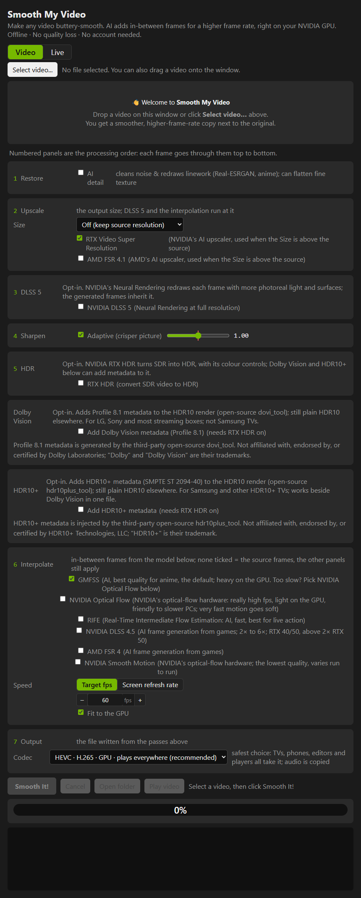
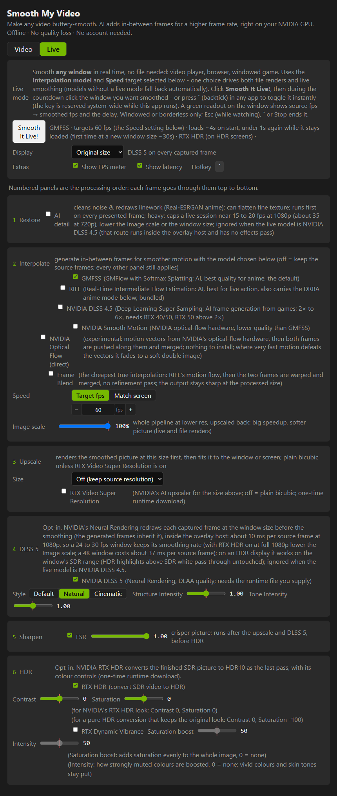

  

<h1 align="center">Smooth My Video</h1>

  <b>Offline AI frame interpolation for NVIDIA GPUs.</b> 
  Drop in a video, pick a target frame rate, and get a buttery-smooth high-FPS copy,
  no cloud, no subscription, no install.

  
  
  

   
  <b>The same shot, before and after.</b> Left: a classic anime-style pan at 10 fps, the cadence anime pans are actually drawn at. Right: the same clip interpolated 5&times; to 50 fps. Every original frame passes through untouched; the AI draws only the frames in between.

   
  <b>It also brings 108-year-old anime back to life.</b> Left: <i>Namakura Gatana</i> (1917, public domain), 15 fps with a century of film grain. Right: the same frames after AI detail restoration, 2&times; RTX upscale and 15&rarr;50 fps interpolation, one render. 
  <i>Source: the National Film Center scan, via the Internet Archive (Public Domain Mark).</i>

> *Built because NVIDIA's RTX Video (AI upscaling + TrueHDR) is gorgeous but playback-only: it enhances
> what you watch, then throws it away. Smooth My Video applies those same RTX passes (plus AI frame
> interpolation) straight to your file, so the result is saved, not just streamed.*

---

## What it does

Pick a video (or drag it in), choose a **target frame rate** (double it, 4×, 8× and up, or **match
your monitor's refresh**), and click **Smooth It!**. Smooth My Video generates the in-between frames
with a GMFSS AI model on your GPU and writes a smoother, high-frame-rate copy right next to the
original. In the same render it can also **upscale** (up to 16K) or downscale (720p, or a custom height down to 240p,
for small, fast-to-encode files), **sharpen**, **restore detail**, and
convert **SDR → real HDR10**, while carrying over every audio track, subtitle, chapter and font.

It also does this **live**: Live mode smooths any window on your screen in real time (a video
player, a browser, a windowed game) with no file and no waiting, Lossless-Scaling-style. A
**Video / Live** switch at the top of the window picks between the two, so
each mode shows only its own controls plus the settings both share.

  

  

Built and tested on an RTX 5090 Laptop; runs on any recent NVIDIA GPU with a current driver.

## Why choose it

* 🎞️ **Smooth *and* sharp.** Your real frames pass through at full quality with AI-generated frames woven
  in between, you get the higher frame rate without softening or reprocessing the original footage.
  When two frames in a row are exactly identical (a paused picture, a held drawing), that pair is
  passed through as it is instead of being redrawn, so a still image stays perfectly still.
* 🧊 **10-bit output by default.** Float-precision interpolated frames are written at 10-bit, so smooth
  gradients (skies, glows) never band into visible steps.
* 🎨 **Production-grade HDR10.** Real SDR→HDR10 conversion with proper mastering metadata
  (mastering-display + measured MaxCLL/MaxFALL) and faithful, cyan-free colour, not just a PQ tag.
* 🌈 **Dolby Vision Profile 8.1 export.** Optionally add Profile 8.1 dynamic-HDR metadata on
  top of the HDR10 render, HDR10-compatible, so non-DV players fall back to HDR10. Uses the
  separately-installed open-source [dovi_tool](https://github.com/quietvoid/dovi_tool); no Dolby software
  is bundled.
* ➕ **HDR10+ export.** Optionally embed HDR10+ (SMPTE ST 2094-40) dynamic-HDR metadata,
  measured per frame from the actual render, also HDR10-compatible, and combinable with Dolby Vision.
  Uses the separately-installed open-source
  [hdr10plus_tool](https://github.com/quietvoid/hdr10plus_tool).
* 🔍 **AI upscaling to 16K + detail restoration.** NVIDIA RTX Video Super Resolution plus a Real-ESRGAN
  restore pass, layered with the interpolation in a single render. AMD FSR 4.1 upscaling (AMD's AI upscaler) is built in as
  the alternative to RTX VSR (tick one or the other; neither = a classic Lanczos resize).
* 💬 **Keeps every track.** All audio, subtitles/translations, chapters and font attachments are preserved
  (auto-switches to `.mkv` when needed), nothing silently dropped.
* 🗜️ **Visually lossless.** HEVC / AV1 / H.266 encodes at maximum encoder effort, tuned and verified
  against a lossless 8K master (VMAF ~99.8, SSIM ≥ 0.995), no fiddly quality knob to guess at.
* 📦 **100% offline & self-contained.** Extract the archive and run, no Python, no pip, no ffmpeg to install,
  no account, no cloud upload. Only the NVIDIA driver is assumed. Free.
* ⚡ **Fast.** fp16 with a TensorRT backend, built and cached per resolution. The app also tells you when a
  laptop "Silent" power profile is throttling the GPU.
* 🧺 **Set-and-forget batches.** Queue many files; a file that fails is noted and the rest keep rendering,
  and a batch interrupted by a crash or restart is re-queued on the next launch.
* 📱 **Handles real-world files.** Variable-frame-rate sources (phone clips, screen recordings) are
  detected and timed correctly, so audio never drifts out of sync.
* 🔁 **Reproducible.** The same file with the same settings renders byte-for-byte identically, every time.
  The exception is the NVIDIA Smooth Motion model, which is non-deterministic.
* 🎛️ **One size control per mode.** File renders pick the output **Size** and run every pass at it
  (Restore and the resize first, then DLSS 5 and the interpolation; RTX Video Super Resolution
  enlarges when the Size is above the source). Live's size is what **Display** shows (the window, or
  the screen), and its **DLSS mode** is its speed lever, NVIDIA's share of that size: DLAA (the
  default, the full size), Quality (67%), Balanced (58%), Performance (50%) or Ultra Performance
  (33%) from the dropdown, or any share down to 1% with its slider (the dropdown then reads Custom);
  lower is much faster and softer, and the fit to the window or screen enlarges the result.
* 🧠 **Optional NVIDIA DLSS 5 pass.** One checkbox runs NVIDIA's DLSS 5 Neural Rendering on every
  source frame before the smoothing (after Restore and the resize, at the output size; in Live at
  its DLSS mode's size), at full resolution (its own size in, the same size out), fed the way game integrations
  feed it (NVIDIA's automatic mask and motion vectors from NVIDIA's Optical Flow hardware, in file
  renders and live, so its history follows the picture, and a paused or held picture stays
  perfectly still), with NVIDIA's three
  looks as a **Style** selector (Default, Natural, Cinematic) and its two global controls,
  **Structure Intensity** and **Tone Intensity**, as sliders. The host is bundled; the
  Neural Rendering runtime (`nvngx_dlssnr.dll`) is not included, and NVIDIA publishes no download
  for it (it only ships inside NBA 2K27), so the app offers a one-click **Download the DLSS 5
  runtime** button that fetches the community RTX 40 + 50 build every DLSS 5 tool uses
  ([rhi-repo](https://github.com/RankFTW/rhi-repo/releases) on GitHub), verifies its SHA256 and
  installs it. Already have the file? Drop it on the window instead. It applies in Live mode too
  (once per captured frame, before the smoothing, inside the overlay host itself, so a 1080p
  window keeps its smoothing rate; SDR windows, or the SDR range of any window on an HDR display). In the preview, **Show changed pixels** turns the Processed
  pane into a heat map of where the pass changed the picture (bright = large change, dark = untouched).
* ✨ **Optional DLSS 4.5 model.** One checkbox switches the interpolation to NVIDIA's DLSS Frame
  Generation, the AI frame generation from their game stack, hosted offline by a bundled bare-bones
  D3D12 presentation loop (DLSS-FG has no video API, so the app runs one for it). Fully bundled
  (~10 MB, NVIDIA-redistributable Streamline runtime); whole multipliers 2×–6× on the source grid
  (multi-frame generation; above 2× needs an RTX 50); needs an RTX 40/50 GPU, a recent driver and
  Windows hardware-accelerated GPU scheduling. One caveat: NVIDIA's RTX Video enhancement
  (Super Resolution / Video HDR) processing a video playing in a browser preempts frame
  generation. The render detects the stall within seconds and heals itself once the video is
  closed or paused; if the interference persists it stops cleanly with progress saved, and
  Resume continues from there (other models are unaffected).
* 🔴 **Live mode: real-time frame generation on any window.** The Lossless-Scaling-style feature,
  built in and free: press **`** (backtick) in any app and the window you're in goes live behind a
  click-through overlay showing DLSS Frame Generation output at 2×–6×, in real time; press **`**
  again to stop (the key is reserved system-wide while the app runs). Or click **Smooth It Live!**
  and then click the window within 5 seconds. No file, no render, no waiting; Stop (or Esc on the overlay) ends it.
  Same requirements as the DLSS 4.5 model (RTX 40/50, above 2× needs an RTX 50; the RIFE and GMFSS
  live models run on any RTX); windowed or borderless windows only (exclusive fullscreen
  can't be captured). Changing the Speed target or the DLSS mode while a session is running restarts it a moment
  later with the new setting, on the same window. Switching to another app pauses the smoothing
  and hides the overlay; returning to your window resumes it. The Display selector starts on **Whole screen**: the
  whole monitor at once (everything on it, works with every model including DLSS 4.5). **Original size** smooths only
  the window, and **Fill screen** fills the screen with it (upscaled, aspect kept;
  clicks on the stretched picture reach the matching spot of your window: while the cursor is on the picture, SMV draws it
  and slows the pointer by the stretch, and gives the normal pointer back when the cursor leaves the picture or Live stops). With the RIFE, GMFSS, NVIDIA Smooth Motion or AMD FSR 4 model the smoothing is **adaptive**: the output locks to
  your fps target (the same Speed setting file renders use) and the multiplier follows the
  content, so a game dropping from 30 to 10 fps keeps playing at the same smooth rate on
  screen. The target goes up to 10000 fps; with **Fit to the GPU** ticked (the default) Live lowers the smoothing
  to what your GPU keeps up with, down to the source's own rate with every effect still on, so every source frame
  is shown with little delay. Unticked, everything runs as set and a
  target the GPU can't reach skips source frames. File renders always keep their exact fps; unticked, they just
  run slower when video memory runs short. Your Sharpen and Restore settings apply live too (Restore,
  DLSS 5, Sharpen and RTX HDR work on each captured frame before the smoothing, once per captured frame),
  and Fill screen upscales with RTX VSR when it's enabled. With NVIDIA DLSS 4.5 as the live model they apply
  too, with the DLSS mode and Fill: the effects run on each captured frame and DLSS 4.5 generates its frames from
  the result. Untick every interpolation model and Live applies just those effects to the
  window at its own frame rate (useful for the growing set of apps that only need the
  picture cleaned or expanded). A small
  green readout in the corner shows the source fps, the smoothed fps, and roughly how far the
  picture runs behind reality (about a source frame; made for watching, not for competitive
  play). Every model runs inside the overlay itself, with no separate engine process, which keeps
  latency and processor use low; file renders run in the same engine host.
* 🎬 **A RIFE model for live action.** GMFSS is an anime specialist; one checkbox switches to
  Practical-RIFE 4.26 heavy (bundled, nothing to install), the strongest open general-purpose
  interpolation model - the pick for filmed content. TensorRT-accelerated like GMFSS. Its
  **Preserve anime pacing (DRBA)**
  sub-option keeps characters at their original animation cadence while camera pans smooth
  fully, for purists who want fluidity without "hollywoodizing" the animation. It works in Live
  mode too, at the cost of one source frame of extra delay (it needs the next frame before it can
  place the ones around the current one).
* 🌀 **Optional NVIDIA Smooth Motion model.** One checkbox switches the interpolation from the GMFSS AI
  model to NVIDIA's hardware optical-flow FRUC (the same family as the driver-level Smooth Motion), for
  when you want the NVIDIA look or a non-AI reference. The lowest quality of the models, and
  non-deterministic; the NVIDIA runtime is a one-time separate download (not bundled).
* 🔺 **AMD FSR 4 frame generation.** One more checkbox runs AMD's FSR 4 frame generation, AMD's
  machine-learning model (bundled, nothing to install), steered by NVIDIA's optical flow, live and for file
  renders. On NVIDIA GPUs it runs through the open-source vkd3d-proton (D3D12 on Vulkan); tested on an
  RTX 5090. Cleaner than FSR 3.1 on fast pans, though fine edges can still break up on fast anime motion
  where GMFSS stays clean. Its first start takes longer while its shaders compile (cached afterwards).
* 🧭 **NVIDIA Optical Flow.** One more checkbox runs NVIDIA's hardware
  optical-flow unit straight from the app, nothing to install (the NVIDIA driver
  provides it), live and for file renders. Fast, and clean on moderate motion; where very fast
  or twisting motion defeats the hardware's vectors it fades to a soft double image instead of
  breaking up. File renders with it take a whole multiplier (it tells you when the Speed target is
  not one).
* 🎚️ **Plus the essentials:** Adaptive Sharpen (bacondither's two-pass HQ sharpener, strength 0 to 2), a live
  before/after preview, every setting remembered
  between runs, and a quiet one-line notice when a newer release is out (nothing auto-downloads).

## Get started

* **Download & run:** grab `SmoothMyVideo-<version>-win.7z` from the
  [latest release](https://github.com/flowreen/SmoothMyVideo/releases/latest) (its `.sha256` and the
  release notes sit beside it), extract it anywhere (Windows 11 23H2 and later open `.7z` in File
  Explorer; on older Windows use [7-Zip](https://www.7-zip.org/) or NanaZip), and run
  **`SmoothMyVideo.exe`** (or the Desktop /
  Start-menu shortcut). No install, no dependencies, just a current NVIDIA driver.
* **From source:** `npm start`. See **[DEVELOPMENT.md](DEVELOPMENT.md)** for the full setup.

## Under the hood

The UI is Electron + TypeScript; every render and Live session runs in one native host (`smv-live.exe`,
C++ on TensorRT for RTX and CUDA), driven by a TypeScript orchestrator that handles probing, encoding and
resume. No Python ships. The default model, **GMFSS_Fortuna**, is a "union" interpolator, GMFlow optical
flow, an IFNet/RIFE refiner, plus MetricNet, FeatureNet, FusionNet and softsplat warping, producing clean
frames even at high multipliers.

📖 **Build it, hack on it, or read the design rationale → [DEVELOPMENT.md](DEVELOPMENT.md)**

## Contributing

Smooth My Video was built end to end by AI coding agents ([Claude Code](https://claude.com/claude-code)),
and it's meant to keep growing that way. If there's a feature you want, open an issue and describe it, or
send a pull request. Contributions are welcome whether you write the code yourself or hand the idea to an
agent, exactly how the rest of this app was built.

---

Dolby and Dolby Vision are trademarks of Dolby Laboratories. Smooth My Video is an independent project and
is not affiliated with, endorsed by, sponsored by, or certified by Dolby Laboratories. Dolby Vision Profile
8.1 metadata is produced by the separately-installed, third-party open-source
[dovi_tool](https://github.com/quietvoid/dovi_tool); no Dolby software is bundled or redistributed.
HDR10+ is a trademark of HDR10+ Technologies, LLC; Smooth My Video is likewise not affiliated with, endorsed
by, or certified by HDR10+ Technologies. HDR10+ metadata is injected by the separately-installed, third-party
open-source [hdr10plus_tool](https://github.com/quietvoid/hdr10plus_tool); no HDR10+ LLC software is bundled
or redistributed.
